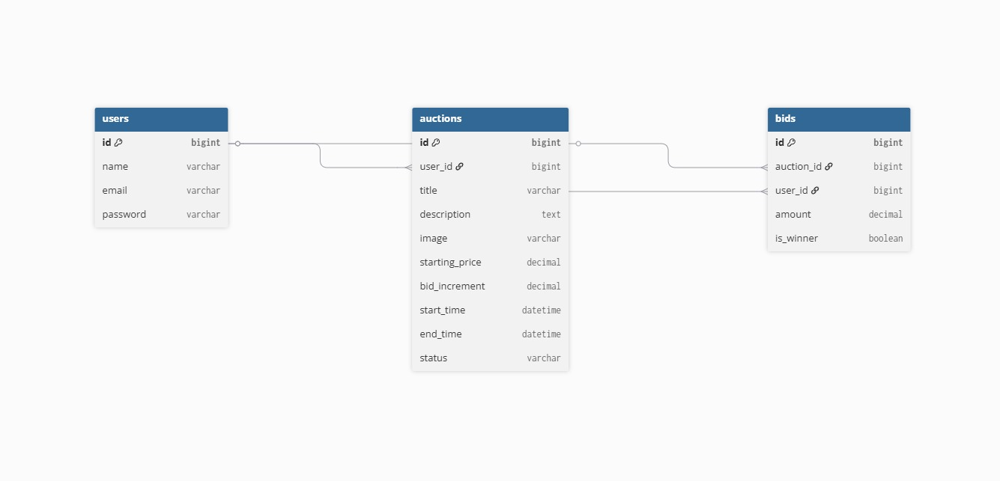

# 🏷️ Online Auction System

## Ujian Akhir Semester (UAS) - Pemrograman Berbasis Web

Sistem Lelang Online berbasis **Laravel 12**, **Vue 3**, **MySQL**, **Laravel Sanctum**, dan **Laravel Reverb** yang mendukung proses lelang secara realtime, pengelolaan barang lelang, serta penentuan pemenang otomatis.

---

# 👨‍💻 Kelompok 5

| Nama                      | NIM        | GitHub               |
| ------------------------- | ---------- | -------------------- |
| Ilham Maulana Kusuma      | 2401010004 | @ilhammaulana05-sudo |
| I Putu Yoga Dhandi Wijaya | 2401010014 | @YogaDhn             |
| I Gede Sumeryasa          | 2401010033 | @sumeragede57        |

---

# 📖 Deskripsi Sistem

Online Auction System merupakan aplikasi berbasis web yang memungkinkan pengguna untuk:

* Membuat lelang barang
* Mengikuti lelang
* Melakukan penawaran harga (bidding)
* Menerima pembaruan data secara realtime
* Menentukan pemenang secara otomatis ketika lelang berakhir

---

# ✨ Fitur Utama

## Authentication

* Register
* Login
* Logout
* Laravel Sanctum Authentication

## Auction Management

* Create Auction
* Edit Auction
* Delete Auction
* My Auctions
* Upload Gambar Barang
* Edit Gambar Barang

## Bidding System

* Realtime Bid
* Bid Validation
* Minimum Increment Bid
* Bid History
* Prevent Self Bidding
* Automatic Winner Selection

## Realtime Features

* Laravel Reverb
* Laravel Echo
* Realtime Bid Update
* Realtime Auction Result
* Winner Announcement

## Auction Lifecycle

* Scheduled Auction
* Active Auction
* Ended Auction
* Countdown Timer
* Automatic Auction Closing

---

# 🛠️ Teknologi yang Digunakan

## Backend

* Laravel 12
* Laravel Sanctum
* Laravel Reverb
* MySQL
* Eloquent ORM

## Frontend

* Vue 3
* Vue Router
* Pinia
* Axios
* Laravel Echo
* Pusher JS

---

# 📋 Prasyarat

Pastikan perangkat telah terinstall:

* PHP 8.2+
* Composer
* Node.js 18+
* NPM
* MySQL
* Git

---

# 🚀 Instalasi Proyek

## Clone Repository

```bash
git clone https://github.com/YogaDhn/uas-pbw-lelang.git
cd uas-pbw-lelang
```

## Backend

```bash
cd lelang

composer install

cp .env.example .env

php artisan key:generate
```

## Frontend

```bash
cd frontend

npm install
```

---

# ⚙️ Konfigurasi Database

Buat database:

```sql
CREATE DATABASE auction_db;
```

Konfigurasi pada file `.env`

```env
DB_CONNECTION=mysql
DB_HOST=127.0.0.1
DB_PORT=3306
DB_DATABASE=auction_db
DB_USERNAME=root
DB_PASSWORD=
```

---

# ⚡ Konfigurasi Laravel Reverb

Tambahkan pada `.env`

```env
BROADCAST_CONNECTION=reverb

QUEUE_CONNECTION=database

REVERB_APP_ID=local
REVERB_APP_KEY=auction-key
REVERB_APP_SECRET=auction-secret

REVERB_HOST=127.0.0.1
REVERB_PORT=8080
REVERB_SCHEME=http
```

---

# 🗄️ Migrasi Database

```bash
php artisan migrate
```

atau

```bash
php artisan migrate:fresh --seed
```

---

# ▶️ Menjalankan Aplikasi

## Backend

```bash
php artisan serve
```

Backend berjalan pada:

```text
http://127.0.0.1:8000
```

---

## Frontend

```bash
npm run dev
```

Frontend berjalan pada:

```text
http://localhost:5173
```

---

## Queue Worker

```bash
php artisan queue:work
```

---

## Scheduler

```bash
php artisan schedule:work
```

---

## Laravel Reverb

```bash
php artisan reverb:start
```

---

# 🔑 Akun Demo

## Penjual

Email:

```text
yoga@gmail.com
```

Password:

```text
password
```

## Penawar

Email:

```text
stella@gmail.com
```

Password:

```text
password
```

---


# 🗃️ Entity Relationship Diagram (ERD)

ERD berikut menggambarkan hubungan antara entitas **Users**, **Auctions**, dan **Bids** pada sistem lelang online.

<p align="center">
  
</p>

## Relasi Antar Entitas

### Users → Auctions

Satu pengguna dapat membuat banyak lelang.

```text
Users (1) -------- (N) Auctions
```

### Users → Bids

Satu pengguna dapat melakukan banyak penawaran (bid).

```text
Users (1) -------- (N) Bids
```

### Auctions → Bids

Satu lelang dapat memiliki banyak penawaran.

```text
Auctions (1) -------- (N) Bids
```

## Struktur Tabel

### Users

| Field      | Tipe      |
| ---------- | --------- |
| id         | bigint    |
| name       | varchar   |
| email      | varchar   |
| password   | varchar   |
| created_at | timestamp |
| updated_at | timestamp |

### Auctions

| Field          | Tipe      |
| -------------- | --------- |
| id             | bigint    |
| user_id        | bigint    |
| title          | varchar   |
| description    | text      |
| image          | varchar   |
| starting_price | decimal   |
| bid_increment  | decimal   |
| start_time     | datetime  |
| end_time       | datetime  |
| status         | varchar   |
| created_at     | timestamp |
| updated_at     | timestamp |

### Bids

| Field      | Tipe      |
| ---------- | --------- |
| id         | bigint    |
| auction_id | bigint    |
| user_id    | bigint    |
| amount     | decimal   |
| is_winner  | boolean   |
| created_at | timestamp |
| updated_at | timestamp |

```
```


# 🧪 Skenario Pengujian

1. Login sebagai Penjual.
2. Membuat barang lelang baru.
3. Login sebagai Penawar pada browser berbeda.
4. Membuka halaman detail lelang yang sama.
5. Melakukan bid.
6. Bid tertinggi diperbarui secara realtime.
7. Riwayat bid diperbarui secara realtime.
8. Sistem menentukan pemenang otomatis saat lelang berakhir.
9. Informasi pemenang ditampilkan pada halaman detail lelang.

---

# 📂 Struktur Folder

```text
PROJECT_UAS_PBW
│
├── app
├── bootstrap
├── config
├── database
├── public
├── routes
├── docs
│   ├── erd.png
│   ├── login.png
│   ├── register.png
│   ├── auction-list.png
│   ├── auction-detail.png
│   ├── create-auction.png
│   ├── my-auctions.png
│   └── winner.png
│
├── frontend
│   ├── src
│   ├── router
│   ├── services
│   ├── stores
│   └── views
│
└── README.md
```

---

# 📌 Catatan

Agar fitur realtime berjalan dengan baik, pastikan service berikut aktif secara bersamaan:

* Laravel Server
* Vue Frontend
* Queue Worker
* Scheduler
* Laravel Reverb

---

# 📄 Lisensi

Proyek ini dibuat untuk memenuhi tugas Ujian Akhir Semester (UAS) Mata Kuliah Pemrograman Berbasis Web Program Studi Sistem Informasi.
